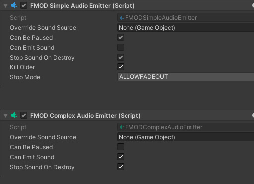
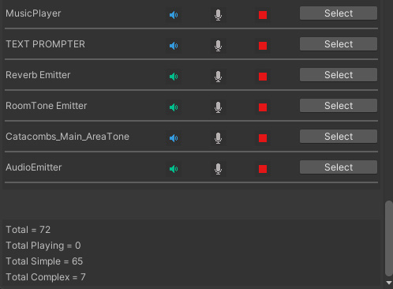

# Mazurka-FMODTools

>**Mazurka-FMODTools** is a set of useful scripts working with a custom audio emitter system for Unity. 

___

### Emitter System

Each object 
 

There is two type of emitter : 
1. SimpleEmitter : *Can handle only one event instance at a time*
2. ComplexEmitter : *Can handle more than one event instance at a time*

___

### Emitter Explorer

